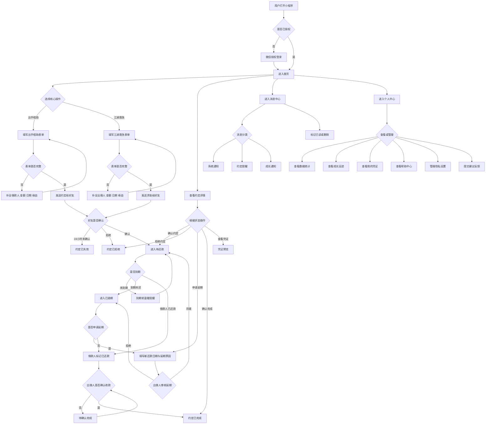
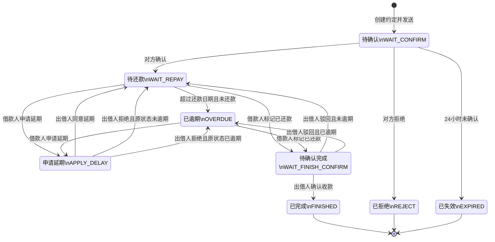

# 《还了么》产品结构图谱

Version：V1.0 MVP + 扩展设计稿口径  
来源：《还了么 PRD V1.0》《还了么设计文档》  
输出范围：信息架构图、用户流程图、页面导航结构、状态流转图、页面清单

---

## 0. 文档说明

### 0.1 产品定位

还了么是一款帮助朋友、同学、同事、情侣之间记录借还约定的小程序。产品不提供借贷、资金、担保或催收服务，仅提供借还记录、到期提醒、凭证辅助、信誉成长等能力，用温暖提醒降低催还尴尬。

### 0.2 范围口径

| 类型 | 范围 |
| --- | --- |
| MVP 主体 | 首页、出手相助、江湖救急、约定详情、延期申请、消息中心、个人中心 |
| 扩展设计稿 | 账本、报表、年度报告、我的凭证、帮助中心、隐私设置、关于我们、建议反馈 |
| 暂不展开 | API 接口、数据库 ER、UI Design System、Figma 高保真原型 |

### 0.3 核心角色

| 角色 | 定义 | 核心诉求 |
| --- | --- | --- |
| 出借人 | 借出资金、等待对方归还的一方 | 记录约定、减少催促、确认收款、维护信任 |
| 借款人 | 接收帮助、需要按约归还的一方 | 清楚约定、按期归还、申请延期、保留记录 |
| 普通用户 | 暂无进行中约定或只查看个人信息的用户 | 新手引导、查看成长、管理数据与隐私 |

---

## 1. 信息架构图 IA

```mermaid
graph TD
    A["还了么小程序"] --> B["用户进入"]
    B --> B1["微信授权与用户信息"]
    B --> B2["新手引导"]

    A --> C["一级导航"]
    C --> C1["首页"]
    C --> C2["消息"]
    C --> C3["我的"]
    C --> C4["扩展入口"]

    C1 --> H1["用户信息卡"]
    C1 --> H2["签到入口"]
    C1 --> H3["出手相助"]
    C1 --> H4["江湖救急"]
    C1 --> H5["我的约定列表"]
    C1 --> H6["空状态引导"]

    H3 --> L1["创建出借约定"]
    L1 --> L11["选择借款人"]
    L1 --> L12["填写金额"]
    L1 --> L13["选择还款日期"]
    L1 --> L14["填写借款缘由"]
    L1 --> L15["上传辅助凭证"]
    L1 --> L16["设置提醒语"]
    L1 --> L17["发送给好友确认"]

    H4 --> R1["创建求助请求"]
    R1 --> R11["选择出借人"]
    R1 --> R12["填写金额"]
    R1 --> R13["选择还款日期"]
    R1 --> R14["填写借款缘由"]
    R1 --> R15["上传辅助凭证"]
    R1 --> R16["填写补充说明"]
    R1 --> R17["发送给好友确认"]

    H5 --> D1["约定详情"]
    D1 --> D11["双方信息"]
    D1 --> D12["金额与日期"]
    D1 --> D13["状态与倒计时"]
    D1 --> D14["缘由与提醒语"]
    D1 --> D15["凭证预览"]
    D1 --> D16["延期记录"]
    D1 --> D17["状态操作按钮"]

    D1 --> E1["延期申请"]
    E1 --> E11["新还款日期"]
    E1 --> E12["延期原因"]
    E1 --> E13["提交申请"]
    E1 --> E14["出借人审核"]

    C2 --> M1["系统通知"]
    C2 --> M2["约定提醒"]
    C2 --> M3["成长通知"]
    C2 --> M4["消息操作"]
    M4 --> M41["未读标记"]
    M4 --> M42["全部已读"]
    M4 --> M43["删除消息"]

    C3 --> P1["个人资料"]
    C3 --> P2["数据统计"]
    C3 --> P3["成长足迹"]
    C3 --> P4["我的凭证"]
    C3 --> P5["帮助中心"]
    C3 --> P6["隐私设置"]
    C3 --> P7["关于我们"]
    C3 --> P8["建议反馈"]

    A --> S["约定状态体系"]
    S --> S1["WAIT_CONFIRM 待确认"]
    S --> S2["WAIT_REPAY 待还款"]
    S --> S3["OVERDUE 已逾期"]
    S --> S4["APPLY_DELAY 申请延期"]
    S --> S5["WAIT_FINISH_CONFIRM 待确认完成"]
    S --> S6["FINISHED 已完成"]
    S --> S7["REJECT 已拒绝"]
    S --> S8["EXPIRED 已失效"]

    A --> G["成长与信誉体系"]
    G --> G1["信誉分"]
    G --> G2["成长等级"]
    G --> G3["签到加分"]
    G --> G4["完成约定加分"]
    G --> G5["逾期扣分"]

    C4 --> X1["账本 后续规划"]
    C4 --> X2["报表 后续规划"]
    C4 --> X3["年度报告 后续规划"]
    C4 --> X4["数据导出 后续规划"]
```



---

## 2. 用户流程图 User Flow



### 2.1 出手相助主流程

1. 用户从首页点击“出手相助”。
2. 选择借款人，填写金额、还款日期、借款缘由。
3. 可选上传辅助凭证，设置提醒语。
4. 发送约定给好友。
5. 好友在 24 小时内确认后，约定进入“待还款”。
6. 借款人还款后提交完成确认。
7. 出借人确认收款后，约定进入“已完成”。

### 2.2 江湖救急主流程

1. 用户从首页点击“江湖救急”。
2. 选择出借人，填写金额、还款日期、借款缘由。
3. 可选上传辅助凭证，填写补充说明。
4. 发送求助给好友。
5. 好友确认后，约定进入“待还款”。
6. 后续还款、延期、完成确认流程与出手相助一致。

### 2.3 延期申请流程

1. 借款人在约定详情页点击“申请延期”。
2. 填写新还款日期与延期原因。
3. 提交后进入“申请延期”状态。
4. 出借人同意后，约定回到“待还款”，并更新还款日期。
5. 出借人拒绝后，约定回到原状态，并向借款人发送通知。

### 2.4 消息触达流程

1. 系统根据约定状态、到期时间、成长变化生成消息。
2. 消息进入消息中心，并按系统通知、约定提醒、成长通知分类。
3. 用户可查看、标记已读、全部已读或删除消息。
4. 约定提醒类消息可跳转对应约定详情页处理。

---

## 3. 页面导航结构

```text
还了么小程序
├─ 前置能力
│  ├─ 微信授权登录页
│  ├─ 用户信息授权弹窗
│  ├─ 好友选择器
│  └─ 新手引导弹层
│
├─ Tab 1：首页
│  ├─ 用户信息卡
│  │  ├─ 头像
│  │  ├─ 昵称
│  │  ├─ 信誉分
│  │  ├─ 成长等级
│  │  └─ 签到入口
│  ├─ 快捷入口区
│  │  ├─ 出手相助
│  │  └─ 江湖救急
│  ├─ 我的约定列表
│  │  ├─ 待处理分组
│  │  ├─ 进行中分组
│  │  ├─ 已完成分组
│  │  ├─ 已逾期分组
│  │  └─ 空状态引导
│  ├─ 出手相助创建页
│  │  ├─ 借款人选择
│  │  ├─ 金额输入
│  │  ├─ 还款日期选择
│  │  ├─ 借款缘由填写
│  │  ├─ 辅助凭证上传
│  │  ├─ 提醒语编辑
│  │  └─ 发送约定确认弹窗
│  ├─ 江湖救急创建页
│  │  ├─ 出借人选择
│  │  ├─ 金额输入
│  │  ├─ 还款日期选择
│  │  ├─ 借款缘由填写
│  │  ├─ 辅助凭证上传
│  │  ├─ 补充说明填写
│  │  └─ 发送求助确认弹窗
│  ├─ 约定详情页
│  │  ├─ 双方信息
│  │  ├─ 金额与还款日期
│  │  ├─ 当前状态
│  │  ├─ 缘由与提醒语
│  │  ├─ 凭证预览
│  │  ├─ 延期记录
│  │  ├─ 创建时间与更新时间
│  │  └─ 状态操作区
│  └─ 延期申请页
│     ├─ 新还款日期选择
│     ├─ 延期原因填写
│     └─ 提交申请确认弹窗
│
├─ Tab 2：消息
│  ├─ 消息中心页
│  │  ├─ 系统通知
│  │  ├─ 约定提醒
│  │  ├─ 成长通知
│  │  ├─ 未读标记
│  │  ├─ 全部已读
│  │  └─ 消息删除
│  └─ 消息详情或跳转
│     ├─ 跳转约定详情
│     ├─ 跳转成长足迹
│     └─ 跳转系统说明
│
├─ Tab 3：我的
│  ├─ 个人中心页
│  │  ├─ 用户资料
│  │  ├─ 信誉等级
│  │  ├─ 成长等级
│  │  ├─ 数据统计
│  │  ├─ 成长足迹
│  │  ├─ 建议反馈入口
│  │  └─ 功能入口列表
│  ├─ 我的凭证页
│  │  ├─ 全部凭证
│  │  ├─ 辅助凭证
│  │  ├─ 还款凭证
│  │  ├─ 凭证预览
│  │  └─ 删除二次确认
│  ├─ 帮助中心页
│  │  ├─ 搜索问题
│  │  ├─ 约定流程
│  │  ├─ 信誉分规则
│  │  ├─ 成长等级规则
│  │  ├─ 凭证与隐私
│  │  └─ 联系客服或提交问题
│  ├─ 隐私设置页
│  │  ├─ 数据可见范围
│  │  ├─ 凭证隐私
│  │  ├─ 消息提醒
│  │  └─ 数据管理
│  ├─ 关于我们页
│  │  ├─ 产品介绍
│  │  ├─ 版本信息
│  │  ├─ 用户协议
│  │  └─ 隐私政策
│  └─ 建议反馈页
│     ├─ 提交建议
│     ├─ 热门建议
│     └─ 建议采纳通知
│
└─ 扩展规划入口
   ├─ 账本
   │  ├─ 今日账本
   │  ├─ 记一笔弹窗
   │  ├─ 预算设置
   │  └─ 消费分布
   ├─ 报表
   │  ├─ 年度温暖总览
   │  ├─ 趋势图
   │  ├─ 好友温暖分布
   │  ├─ 金额流向
   │  └─ 成长足迹
   ├─ 年度报告
   │  ├─ 年度封面
   │  ├─ 核心数据
   │  ├─ 成长印记
   │  └─ 保存或分享
   └─ 数据导出
      ├─ 导出图片
      ├─ 导出 PDF
      └─ 导出个人数据
```

---

## 4. 状态流转图



### 4.1 状态定义

| 状态 code | 中文名 | 触发条件 | 可执行操作 | 终态 |
| --- | --- | --- | --- | --- |
| WAIT_CONFIRM | 待确认 | 约定创建并发送后，等待对方确认 | 确认、拒绝、等待超时 | 否 |
| WAIT_REPAY | 待还款 | 双方已确认，等待借款人还款 | 标记已还款、申请延期、温暖提醒 | 否 |
| OVERDUE | 已逾期 | 超过约定还款日期且未完成还款 | 标记已还款、申请延期、温暖提醒 | 否 |
| APPLY_DELAY | 申请延期 | 借款人提交延期申请，等待出借人审核 | 同意延期、拒绝延期 | 否 |
| WAIT_FINISH_CONFIRM | 待确认完成 | 借款人标记已还款，等待出借人确认 | 确认收款、驳回 | 否 |
| FINISHED | 已完成 | 出借人确认收款，双方完成约定 | 查看详情、查看凭证 | 是 |
| REJECT | 已拒绝 | 对方拒绝约定 | 查看详情 | 是 |
| EXPIRED | 已失效 | 24 小时内未确认，系统自动关闭 | 查看详情 | 是 |

---

## 5. 页面清单

### 5.1 MVP 页面清单

| 页面名称 | 页面类型 | 所属导航 | 入口 | 核心功能 | 关键状态 | 备注 |
| --- | --- | --- | --- | --- | --- | --- |
| 首页 | Tab 首页 | 首页 | 小程序默认进入 | 展示用户信息、签到、快捷入口、约定列表、新手引导 | 待确认、待还款、待确认完成、已完成、已逾期 | MVP 核心首页 |
| 出手相助创建页 | 二级页面 | 首页 | 首页快捷入口、空状态引导 | 创建借给好友的约定，填写借款人、金额、日期、缘由、凭证、提醒语 | 创建后进入 WAIT_CONFIRM | MVP 核心流程 |
| 江湖救急创建页 | 二级页面 | 首页 | 首页快捷入口、空状态引导 | 创建向好友求助的请求，填写出借人、金额、日期、缘由、凭证、补充说明 | 创建后进入 WAIT_CONFIRM | MVP 核心流程 |
| 约定详情页 | 二级页面 | 首页、消息中心、个人中心相关入口 | 约定卡片、消息提醒、凭证列表 | 展示双方信息、金额、状态、缘由、提醒语、凭证、延期记录、时间信息 | 全状态 | 根据状态展示不同操作按钮 |
| 延期申请页 | 二级页面 | 约定详情 | 约定详情页“申请延期” | 填写新还款日期、延期原因并提交审核 | APPLY_DELAY | 借款人操作，出借人审核 |
| 消息中心页 | Tab 消息 | 消息 | 底部 Tab、个人中心入口 | 系统通知、约定提醒、成长通知、未读、全部已读、删除 | 消息未读、已读、已删除 | MVP 核心消息页 |
| 个人中心页 | Tab 我的 | 我的 | 底部 Tab | 用户资料、信誉等级、成长等级、数据统计、功能入口 | 正常、未授权、数据为空 | MVP 核心个人页 |

### 5.2 个人中心扩展页面清单

| 页面名称 | 页面类型 | 所属导航 | 入口 | 核心功能 | 关键状态 | 备注 |
| --- | --- | --- | --- | --- | --- | --- |
| 我的凭证页 | 二级页面 | 我的 | 个人中心“我的凭证” | 查看全部凭证、按类型筛选、预览凭证、删除凭证 | 全部、辅助凭证、还款凭证 | 设计文档扩展，凭证仅双方可见 |
| 帮助中心页 | 二级页面 | 我的 | 个人中心“帮助中心” | 搜索问题、查看约定流程、信誉分规则、成长等级、凭证隐私说明 | 搜索、展开 FAQ | 设计文档扩展 |
| 隐私设置页 | 二级页面 | 我的 | 个人中心“隐私设置” | 设置数据可见范围、凭证隐私、消息提醒、数据管理 | 开启、关闭、二次确认 | PRD 安全设计要求的承接页 |
| 关于我们页 | 二级页面 | 我的 | 个人中心“关于我们” | 展示产品介绍、版本信息、用户协议、隐私政策 | 正常 | 设计文档扩展 |
| 建议反馈页 | 二级页面 | 我的 | 个人中心“建议反馈” | 提交建议、查看热门建议、接收采纳通知 | 草稿、已提交、已采纳 | 设计文档扩展，关联信誉加分规则 |

### 5.3 扩展规划页面清单

| 页面名称 | 页面类型 | 所属导航 | 入口 | 核心功能 | 关键状态 | 备注 |
| --- | --- | --- | --- | --- | --- | --- |
| 账本首页 | 扩展 Tab 或入口页 | 扩展规划 | 底部扩展 Tab 或首页入口 | 查看当日消费、预算进度、消费记录 | 空状态、已有记录、超预算 | PRD 暂不包含，设计文档扩展 |
| 记一笔弹窗 | 弹窗 | 账本 | 账本悬浮按钮 | 输入金额、分类、备注、日期、时间 | 编辑中、保存成功、校验失败 | 后续规划 |
| 预算设置页 | 二级页面 | 账本 | 账本“设置明日预算” | 设置预算、查看预算建议 | 未设置、已设置、超预算 | 后续规划 |
| 报表页 | 扩展页面 | 扩展规划 | 个人中心或扩展入口 | 年度总览、趋势图、好友分布、金额流向、成长足迹 | 有数据、无数据、筛选中 | PRD 暂不包含，设计文档标注仍需完善 |
| 年度报告页 | 扩展页面 | 扩展规划 | 报表页“生成年度报告” | 年度封面、核心数据、成长印记、寄语、保存分享 | 生成中、生成成功、生成失败 | PRD 暂不包含 |
| 数据导出页 | 扩展页面 | 扩展规划 | 隐私设置或报表页 | 导出个人数据、导出图片、导出 PDF | 待确认、导出中、导出完成 | PRD 暂不包含，安全设计中提到支持数据导出 |

### 5.4 公共组件与弹窗清单

| 名称 | 类型 | 使用页面 | 核心功能 | 备注 |
| --- | --- | --- | --- | --- |
| 微信授权弹窗 | 弹窗 | 首次进入、需要用户信息时 | 获取用户头像、昵称等基础信息 | 默认微信生态能力 |
| 好友选择器 | 系统能力或组件 | 出手相助、江湖救急 | 选择借款人或出借人 | 用于建立双方约定 |
| 日期选择器 | 组件 | 创建页、延期申请、记一笔 | 选择还款日期或账本日期 | 禁止手输错误日期 |
| 金额输入键盘 | 组件 | 创建页、记一笔 | 输入金额 | 需限制金额格式 |
| 凭证上传组件 | 组件 | 创建页、详情页、我的凭证 | 上传、预览辅助凭证 | 凭证加密存储，仅双方可见 |
| 状态操作按钮组 | 组件 | 约定详情、首页卡片 | 根据状态展示确认、拒绝、延期、确认完成等操作 | 与状态机强绑定 |
| 二次确认弹窗 | 弹窗 | 删除凭证、注销账号、清空消息 | 防误操作 | 删除类操作必须出现 |
| 空状态引导 | 组件 | 首页、账本、报表、凭证 | 引导首次创建或查看说明 | 用温暖文案降低冷启动成本 |

---

## 6. 一致性与验收标准

### 6.1 Mermaid 图验收

| 图表 | Mermaid 类型 | 验收标准 |
| --- | --- | --- |
| 信息架构图 IA | graph TD | 能清晰表达产品模块、页面模块、状态体系、扩展规划 |
| 用户流程图 | flowchart TD | 能覆盖创建、确认、还款、延期、完成、消息和个人中心主链路 |
| 状态流转图 | stateDiagram-v2 | 状态枚举与 PRD 第七章一致，转移条件清晰 |

### 6.2 产品一致性验收

| 检查项 | 标准 |
| --- | --- |
| MVP 页面 | 与 PRD 第四、第五、八章保持一致 |
| 状态枚举 | 与 PRD 第七章保持一致 |
| 扩展功能 | 均标注为“扩展规划”或“设计文档扩展” |
| 页面层级 | 能支持产品、设计、研发直接对齐 |
| 安全口径 | 明确产品不提供借贷、资金、担保、催收服务 |

### 6.3 后续建议

1. 在本结构基础上继续输出 UI 页面结构设计，明确每个页面的信息区块、组件和交互状态。
2. 为约定详情页补充“不同状态下按钮展示规则表”，便于研发落地。
3. 为消息中心补充消息触发规则和消息模板。
4. 为扩展规划功能单独建立版本优先级，避免账本、报表、年度报告与 MVP 主链路混淆。
