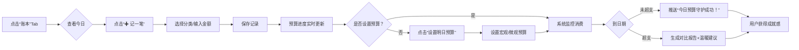
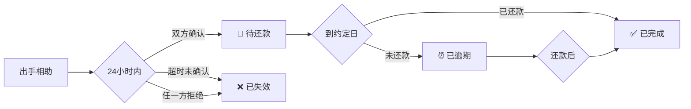
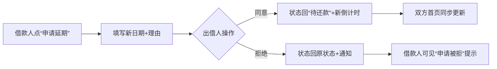

## 一 项目介绍

**“开口借钱难，催人还款更难”**

朋友间借钱，常因尴尬失了分寸，因遗忘伤了情分。我们相信：**金钱可以量化，但信任值得被温柔守护**。**还了么**不做冷冰冰的账本，而是用**温暖设计+成长体系**，让约定有温度，让守约有回响 ❤️


### 1.1 三大核心价值

- **有温度:** 传统催还款 = 伤感情, 微信智能提醒, 自定义提醒功能, 你负责情谊,我负责守护 
- **有保障:** 记录每一笔借款信息
- **有成长:** 展示各种数据, 记录信誉成长


### 1.2 核心功能

#### **🫶 1. 出手相助** 

- **一键发起**：选择微信好友，填写金额/还款日/缘由（必填，增强信任）
- **智能提示**：根据对方信誉分动态提示（“信誉良好”或“建议沟通确认”）
- **专属提醒语**：设置仅对方可见的暖心留言（如“还款顺利就好～"）
- **凭证辅助**：上传聊天记录/合同等（非转账截图），增强可信度


#### **🆘 2. 江湖救急**

- **坦诚求助**：填写缘由+凭证（病历/聊天记录等），降低开口压力
- **补充说明**：添加“感谢信任，我会准时归还”等暖心话
- **动态鼓励**：根据自身信誉分显示激励文案（“加油，诚实守信！”）


#### **📊 3. 年度数据**

- **年度报告** : 展示每年借款数据, 支持搜索、查找、分析
- **报表展示**：柱状图、饼图、折线图直观展示
- **历史数据** : 支持按历史归档


#### **👤 4. 个人中心**

- **成长路径** : 展示信誉分, 成长等级


#### 💰5.账本


**交互亮点**：

- 滑动日期：左右滑动切换日期，自动加载当日记录
- 消费卡片：点击单条记录可编辑/删除，长按快速复制
- 空状态：*“今天还没消费呀～ 点击「记一笔」开启温暖记录”* + 插画

```text
┌───────────────────────────────────────┐
│  ←  2024-06-01 (今天) 周六  🌤️         │ ← 日期滑动选择器
├───────────────────────────────────────┤
│  🌱 今日预算：¥200 | 已花：¥85 (42%) 	   │ ← 环形进度条+文字
│  [📈 查看消费分布]  [🎯 设置明日预算]     │
├───────────────────────────────────────┤
│  🍜 午餐          ¥30      12:30      │	← 左画出现删除按钮
│  🚌 地铁          ¥5       08:15      │ ← 点击展开详情 , 多一个备注信息
│  ☕ 咖啡          ¥25      15:20      │ ← 还需要编辑 , 你看如何设计交互方式好一点, 或者把前面交互方式
│  🛒 超市          ¥25      18:40      │
├───────────────────────────────────────┤
│                                       │
│              [✚ 记一笔]               │ ← 悬浮按钮（带微动效）
└───────────────────────────────────────┘
```


**✍️ 模块2：极速记账弹窗（3秒完成）**

```text
┌───────────────────────────────────────┐
│  🌸 记一笔温暖消费                    │
├───────────────────────────────────────┤
│  金额：[_____]  [数字键盘]            │
│                                       │
│  分类：[餐饮▼] [交通] [购物] [娱乐]   │ ← 常用分类前置
│        [医疗] [学习] [人情] [其他]    │
│                                       │
│  备注：[今天和闺蜜的下午茶～]          │ ← 智能联想（输入“咖”→“咖啡”）
│                                       │
│  日期：2024-06-01 [🕒 修改]           │
│                                       │
│  [🎤 语音输入]  [📸 拍小票] (灰显)    │ ← 高级功能入口
├───────────────────────────────────────┤
│        [取消]        [✅ 记录]         │
└───────────────────────────────────────┘
```


**🌱 用户记账+预算闭环**




**✍️ 记账弹窗时间设置**


```text
┌───────────────────────────────────────┐
│  🌸 记一笔温暖消费                    │
├───────────────────────────────────────┤
│  金额：[_____]                        │
│  分类：[餐饮▼]                        │
│  备注：[今天和闺蜜的下午茶～] (22/30) │ ← 实时字数统计
│                                       │
│  📅 日期：2024-06-01 [修改]           │ ← 年月日固定选择器（不可手动输入）
│  🕒 时间：14 : 30  [修改]             │ ← 小时/分钟滚轮选择器（默认当前时间）
│                                       │
│  [取消]          [✅ 记录]            │
└───────────────────────────────────────┘
```


## 二 功能介绍

### 2.1 首页


**首页详情**

```
┌──────────────────────────────────────┐
│  👤 小明  [🌱 信芽 68分]  [✨ 已签到]  │  ← 签到一天1分, 两天2分 最高7分, 每周五可额外5分
├──────────────────────────────────────┤
│  [✋ 出手相助]    [🆘 江湖救急]        │
├──────────────────────────────────────┤
│  📅 我的温暖约定（点击卡片查看详情）      │
│                                      │
│  ┌────────────────────────────────┐ │ ← 【默认折叠态】
│  │ 📅 待还款 ｜ 李*  💬            │ │
│  │ 金额：¥2,000 ｜ 约定日：3天后     │ │
│  │ 缘由：项目周转急需...[展开]        │ │ ← 文本截断+“展开”提示
│  │ 📅 倒计时：2天23小时             │ │
│  │ [🔍 已确认]  [🔔 温馨提醒]       │ │
│  └────────────────────────────────┘ │
│                                      │
│  ┌────────────────────────────────┐ │ ← 【点击后展开全部信息】✨
│  │ 📅 待还款 ｜ 李*  💬               │ │
│  │ ─────────────────────────────── │ │
│  │ 💰 金额：¥2,000                  │ │
│  │ 📅 约定归还日：2024-07-05        │ │
│  │ 🌧️ 延期记录：                    │ │ ← 【核心新增】
│  │   • 6/20 申请延期至7/10          │ │
│  │     理由：项目回款延迟           │ │
│  │     状态：✅ 已同意（6/21）      │ │
│  │   • 5/15 申请延期至6/20          │ │
│  │     理由：客户付款推迟           │ │
│  │     状态：✅ 已同意（5/16）      │ │
│  │ ─────────────────────────────── │ │
│  │ 📝 借款缘由：                    │ │
│  │ “朋友创业项目急需周转，           │ │
│  │  用于采购首批原材料，             │ │
│  │  承诺回款后第一时间归还~"         │ │ ← 完整显示（无截断）
│  │ ─────────────────────────────── │ │
│  │ 💬 还款提醒语：                   │ │
│  │ “周转顺利就好，有需要随时说~"    │ │
│  │ ─────────────────────────────── │ │
│  │ 📎 凭证：[🖼️ 1张]                │ │ ← 点击预览大图
│  │   [缩略图：转账截图]              │ │
│  │ ─────────────────────────────── │ │
│  │ 👤 出借人操作：                  │ │
│  │ [✅ 确认完成]  [✏️ 修改提醒]     │ │
│  │ [↩️ 折叠卡片]                    │ │ ← 新增折叠按钮
│  └────────────────────────────────┘ │
│                                      │
│  ┌────────────────────────────────┐ │
│  │ ⏰ 已逾期 ｜ 王*  💬               │ │ ← 折叠态示例
│  │ 金额：¥1,000 ｜ 逾期：2天        │ │
│  │ 缘由：医疗急用...[展开]          │ │
│  │ [🔔 温馨提醒]                    │ │
│  └────────────────────────────────┘ │
│                                      │
│  ┌────────────────────────────────┐ │
│  │ 🌸 温暖新手村（无约定时全屏）    │ │
│  │ • 点击任意卡片可展开查看详情     │ │ ← 新增引导提示
│  │ • 凭证/延期记录一目了然          │ │
│  └────────────────────────────────┘ │
├──────────────────────────────────────┤
│  ℹ️ 本记录仅用于约定提醒与情谊守护，无任何法律效力 │
└──────────────────────────────────────┘

---- 没有记录展示这条信息 -----
│  ┌────────────────────────────────┐ │
│  │ 🌱 新手引导区（无约定时显示）   │ │
│  │                                  │ │
│  │   🌸 暂无约定？别慌！            │ │
│  │   第一份温暖，从这里开始~        │ │
│  │                                  │ │
│  │   💡 小贴士：                    │ │
│  │   • 出手相助：当朋友需要时撑把伞 │ │
│  │   • 江湖救急：遇到困难大胆开口   │ │
│  │                                  │ │
│  │   [🤝 立即出手]  [🆘 发起求助]   │ │ ← 引导按钮（与中部同功能）
│  │                                  │ │
│  │   🌟 已有10,283位朋友在此守护情谊 │ │
│  └────────────────────────────────┘ │
```


#### 2.1.1 **出手相助**




#### 2.1.2 申请延期




#### 2.1.3 出手相助和江湖救急页面

​	创建出手相助和江湖救急 提供默认表单, 后续加上樱桃粉和契约风主体, 表单内容不变, 风格样式变化 ; 最好不同主题有不同的额外功能和效果

- 出手相助

```tex
┌──────────────────────────────────────────────────────┐
│  ☔ 为TA撑把伞 · 温暖约定                              │
├──────────────────────────────────────────────────────┤
│  👤 出借人：[头像] 小明 [🏆] 🛡️95分                   │
│     （触碰[🏆]：热心市民｜触碰🛡️：信誉分95/100）│
│                                                      │
│  👤 借款人：[➕ 选择微信好友]                         │
│  → 选择后：                                           │
│     👤 借款人：[头像] 李* [🪙] 🛡️85分                 │
│     （触碰[🪙]：纯路人｜触碰🛡️：信誉分85/100） │
│                                                      │
│  💡【动态提示语】（基于借款人信誉分）                │
│  • 借款人信誉分≥100：                                │
│    "💡 信誉良好：对方信誉满分，温暖约定超安心~"      │
│  • 借款人信誉分<100：                                │
│    "💡 考虑清楚：建议沟通确认还款计划后再决定"       │
│                                                      │
│  💰 金额：[________] 元  （必填｜数字键盘）          │
│  📅 约定还款日：[________]  （必填｜日期选择器）     │
│                                                      │
│  📝 缘由（必填｜200字内）：                          │
│  ┌────────────────────────────────────────────────┐ │  ← 缘由可以提供一些默认选项
│  │ 例：项目周转急需资金，7月回款后立即归还        		│ │
│  │                                                │ │
│  └────────────────────────────────────────────────┘ │
│  💡 提示：清晰说明用途，增强对方信任感              	│
│                                                      │
│  📎 凭证记录（可选）：                               │	
│  [📎 上传凭证]  (总计≤3张)               			│	 ← 图片最多上传三张
│  💡 提示：聊天记录/转账截图等辅助凭证, 只可增加不可减少       │
│           卡片完成之前都可以上传                       │
│  💬 设置您的专属提醒语（仅出借人方可见）：               	│
│  ┌────────────────────────────────────────────────┐ │
│  │ 还款顺利就好~（默认）                          	  │ │ ← 默认提示语, 出借人可自定义编辑, 借款人不可见
│  └────────────────────────────────────────────────┘ │
│  💡 提示：还款日将自动发送此消息给借款人            		│
│                                                      │
│  [↩️ 返回]          [📤 发送约定]                     │ ← 点击发送, 跳转微信列表, 发送连接
│  💡 发送后，等待对方确认                             	│
└──────────────────────────────────────────────────────┘
```


- 江湖救急

​	功能与出手相助类似

```text
┌──────────────────────────────────────────────────────┐
│  🌟 开口是勇敢 · 温暖求助                            │
├──────────────────────────────────────────────────────┤
│  👤 借款人：[头像] 您 [🪙] 🛡️95分                     │
│     （触碰[🪙]：纯路人｜触碰🛡️：信誉分95/100） 			│
│                                                      │
│  💡【动态提示语】（基于自己信誉分）                  		│
│  • 自己信誉分≥100：                                  │
│    "💡 继续勉励：您的信誉满分，保持守约，温暖持续传递！"	│
│  • 自己信誉分<100：                                  │
│    "💡 加油，诚实守信：每一次守约都是成长的养分！"    │
│                                                      │
│  👤 出借人：[➕ 选择微信好友]                         │
│  → 选择后：                                           │
│     👤 出借人：[头像] 小明 [🏆] 🛡️100分              │
│     （触碰[🏆]：热心市民（1笔）｜触碰🛡️：信誉分100/100）│
│                                                      │
│  💰 金额：[________] 元  （必填｜数字键盘）          │
│  📅 期望还款日：[________]  （必填｜日期选择器）     │
│                                                      │
│  📝 缘由（必填｜200字内）：                          │
│  ┌────────────────────────────────────────────────┐ │
│  │ 例：突发医疗费用缺口，手术后15天内归还         │ │
│  │                                                │ │
│  └────────────────────────────────────────────────┘ │
│  💡 提示：坦诚说明情况，更容易获得帮助              │
│                                                      │
│  📎 凭证记录（可选）：                               │
│  [📎 上传凭证]  (本次1-3张，总计≤5张)               │
│  💡 提示：病历/聊天记录等辅助凭证，增强可信度       │
│                                                      │
│  💬 补充说明（可选｜100字内）：                      │
│  ┌────────────────────────────────────────────────┐ │
│  │ 感谢您的信任，我会准时归还！                   │ │
│  └────────────────────────────────────────────────┘ │
│  💡 提示：让对方更安心                              │
│                                                      │
│  [↩️ 返回]          [📤 发送求助]                    │
│  💡 发送后，等待对方确认                             │
└──────────────────────────────────────────────────────┘
```


#### 2.1.4 **首页卡片列表**

```tex
┌──────────────────────────────────────────────────────┐
│  👤 小明  [✨ 已签到]  [🏆] 🛡️95分                   │
├──────────────────────────────────────────────────────┤
│  📌 待处理（1）                                      │
│  ┌────────────────────────────────────────────────┐ │
│  │ 🌸 李* 向您求助                                 │ │
│  │ 💰 ¥2,000 ｜📅 07-25 ｜⏳ 待确认                │ │
│  │ [查看详情]                                      │ │
│  └────────────────────────────────────────────────┘ │
│                                                      │
│  📌 进行中（2）                                      │
│  ┌────────────────────────────────────────────────┐ │
│  │ 🌸 与王* 的约定                                 │ │
│  │ 💰 ¥800 ｜📅 07-20 ｜📅 待还款                  │ │
│  │ [标记还款]                                      │ │
│  └────────────────────────────────────────────────┘ │
│  ┌────────────────────────────────────────────────┐ │
│  │ 🌸 与赵* 的约定                                 │ │
│  │ 💰 ¥1,500 ｜📅 07-15 ｜🔍 待确认还款            │ │
│  │ [确认完成]                                      │ │
│  └────────────────────────────────────────────────┘ │
│                                                      │
│  📌 已完成（3）                                      │
│  ┌────────────────────────────────────────────────┐ │
│  │ 🌸 与钱* 的约定（✅ 已完成）                    │ │
│  │ 💰 ¥500 ｜📅 07-10 ｜🛡️ 守约记录                │ │
│  │ [查看详情]                                      │ │
│  └────────────────────────────────────────────────┘ │
│                                                      │
│  [🫶 出手相助]      [🆘 江湖救急]     [🌱 信誉地图] │
└──────────────────────────────────────────────────────┘
```


### 2.2 报表

​	展示报表信息, 主要是柱状图、折线图、饼图；用户直观感受一年的借款信息，为谁借款次数等信息

​	**设计的还不是很完善, 不够明确, 还需要重新设计**

####  2.2.1页面结构

```tex
┌──────────────────────────────────────────────────────┐
│  📊 温暖数据 · 2024                              [⚙️] │
├──────────────────────────────────────────────────────┤
│  🔍 搜索好友 / 筛选：全部｜出借｜借款｜已完成        │
│  📅 年份：[2024 ▼]  🌐 周期：[月度 ▼]                │
├──────────────────────────────────────────────────────┤
│  🌱【年度温暖总览】（卡片式｜呼吸感留白）             │
│  ┌───────────┬───────────┬───────────┬───────────┐  │
│  │ 💰 信誉值 │ 🤝 约定次数│ 🌟 守约率 │ 🌱 重置倒计时│ │
│  │  120  		│	28次   │   96%    │   152天   │ │
│  └───────────┴───────────┴───────────┴───────────┘  │
├──────────────────────────────────────────────────────┤
│  📈【核心图表】（左右滑动切换｜轻交互）               │
│  ┌────────────────────────────────────────────────┐  │
│  │ 📌 本月趋势（折线图）                          │  │
│  │ 出借次数 ────╮                                 │  │
│  │ 借款次数 ──────╮                               │  │
│  │                ╰───────────────────→ 月份       │  │
│  │ 💡 7月活跃度↑15%，守约率保持100%！             │  │
│  └────────────────────────────────────────────────┘  │
│  ┌────────────────────────────────────────────────┐  │
│  │ 📌 好友温暖分布（饼图｜脱敏处理）              │  │
│  │  [饼图：李* 35%｜王* 25%｜赵* 20%｜...]       │  │
│  │ 💡 与李*的约定最频繁，记得常联系~              │  │
│  └────────────────────────────────────────────────┘  │
│  ┌────────────────────────────────────────────────┐  │
│  │ 📌 金额流向（双柱状图｜出借vs借款）            │  │
│  │  出借：[███] ¥8,000  借款：[█] ¥2,000         │  │
│  │  💡 您是温暖的给予者 ❤️                        │  │
│  └────────────────────────────────────────────────┘  │
├──────────────────────────────────────────────────────┤
│  👥【温暖关系】（脱敏排行榜｜带温度文案）             │
│  🔸 借给TA最多：李*（¥5,200｜5次）                 │
│     "风雨同舟的伙伴，信任值拉满 🌟"                │
│  🔸 向TA借最多：王*（¥1,800｜3次）                 │
│     "雪中送炭的温暖，记得说声谢谢 🌸"              │
│  🔸 约定最频繁：赵*（8次｜守约率100%）             │
│     "默契满分的约定搭子 👯"                        │
│  [查看更多关系]                                     │
├──────────────────────────────────────────────────────┤
│  🌱【成长足迹】（时间轴｜情感化文案）                │
│  📅 2024-07-10：完成与李*的约定 → +5分             │
│  📅 2024-06-25：晋升「热心市民」→ 江湖地位+1       │      ← 这里最好加到个人中心里面,暂时先放在这里
│  📅 2024-05-01：首次上传凭证 → 获得「细致星人」标签 │
│  [查看更多足迹]                                     │
├──────────────────────────────────────────────────────┤
│  🎁【专属功能入口】（底部固定｜高转化）              │
│  [✨ 生成2024温暖报告]  [📥 导出数据]  [❓ 规则说明] │
└──────────────────────────────────────────────────────┘
```


#### 2.2.2年度报告(暂推迟)

```
┌──────────────────────────────────────────────────────┐
│        🌟 2024，你的温暖被看见 🌟                    │
├──────────────────────────────────────────────────────┤
│  📸 封面：手绘风格插画 + "温暖守护者"勋章            │
│  💬 专属文案：                                       │
│  "这一年，你与12位好友完成了28次温暖约定，          │
│   守约率96%——你让信任有了温度 ❤️"                   │
│                                                      │
│  📊 核心数据：                                       │
│  • 温暖值：¥12,800（相当于为3个朋友撑伞365天）     │
│  • 最暖时刻：7月连续完成5次约定                    │
│  • 默契搭子：赵*（8次约定0逾期）                   │
│                                                      │
│  🌱 成长印记：                                       │
│  "从纯路人到热心市民，你用行动定义温暖"             │
│                                                      │
│  💌 2025寄语：                                       │
│  "新一年，愿你的温暖被更多人看见，也被温柔以待"     │
│                                                      │
│  [保存图片]  [分享给好友]（脱敏版：仅显示次数/守约率）│
└──────────────────────────────────────────────────────┘
```


#### 2.2.3 导出(推迟)

| 功能     | 说明                    | 安全设计                      |
| -------- | ----------------------- | ----------------------------- |
| 导出PDF  | 个人存档（含图表+明细） | 本地生成，不上传服务器        |
| 导出图片 | 分享年度报告            | 自动脱敏（金额模糊/好友匿名） |
| 数据清除 | 注销时彻底删除          | 一键清除所有约定数据          |


### 2.3 个人中心

​	

- 页面

```
┌──────────────────────────────────────────────────────┐
│  👤 个人中心                              [⚙️ 设置]   │
├──────────────────────────────────────────────────────┤
│  🌟【温暖名片】（顶部卡片｜渐变背景）                │
│  ┌────────────────────────────────────────────────┐ │
│  │  [头像]                                         │ │
│  │  微信名：温暖小明                               │ │
│  │  🏆 [图标] 热心市民(1笔)  🛡️ 95分（模范市民）  │ │
│  └────────────────────────────────────────────────┘ │
├──────────────────────────────────────────────────────┤
│  📊【温暖数据】（卡片式｜带解读文案）                │
│  ┌───────────┬───────────┬───────────┐              │
│  │ 💰 出借    │ 💰 借款    │ ✅ 已完成 │              │
│  │ ¥8,200    │ ¥1,800    │   25次    │              │
│  └───────────┴───────────┴───────────┘              │
│  ┌───────────┬───────────┬───────────┐              │
│  │ ⏳ 待完成  │ ⚠️ 逾期    │ 🌱 温暖值 │              │
│  │   3次     │   1次     │  12,800   │              │
│  └───────────┴───────────┴───────────┘              │
│  💡 逾期1次已处理｜待完成中1笔7天内到期 → [去处理]  │
├──────────────────────────────────────────────────────┤
│  🌱【成长足迹】（时间轴｜情感化文案）                │
│  📅 2024-07-10：完成与李*的约定 → +5分             │
│  📅 2024-06-25：晋升「热心市民」→ 江湖地位+1       │      
│  📅 2024-05-01：首次上传凭证 → 获得「细致星人」标签 │
│  [查看更多足迹]                                     │
├──────────────────────────────────────────────────────┤
│  💬【共建温暖】（核心新增｜真诚互动）                │
│  ┌────────────────────────────────────────────────┐ │
│  │ 🌟 建议与反馈                                   │ │
│  │ "您的声音，让温暖更美好"                        	│ │
│  │                                                 │ │
│  │ 💡 首次提交有效建议 → 立即+10信誉分！          		│ │
│  │                    	│ │
│  │                                                 │ │
│  │ [📝 我要提建议]                                	│ │ 
│  │                                                 │ │ ← 添加一个留言建议功能,根据需求优化调整
│  │ 📌 热门建议：                                   │ │
│  │ • "增加还款分期功能"（32人支持）               		│ │
│  │ • "约定到期前3天强提醒"（28人支持）            		│ │
│  │ [查看更多建议]                                  │ │
│  └────────────────────────────────────────────────┘ │
├──────────────────────────────────────────────────────┤
│  🌐【功能入口】（图标+文字｜清晰分区）               │
│  🔸 我的凭证：[📁] 查看所有上传凭证                │
│  🔸 消息中心：[🔔] 12条未读（含3条到期提醒）       │
│  🔸 帮助中心：[❓] 常见问题/操作指南                │
│  🔸 隐私设置：[🔒] 控制数据可见范围                │
│  🔸 关于我们：[❤️] 版本v2.1.0｜用户协议｜隐私政策  │
├──────────────────────────────────────────────────────┤
│  🌱【温暖寄语】（底部情感化文案）                    │
│  "每一次守约，都是对信任的温柔守护 ❤️"              │
│                                                      │
│  [🚪 退出登录]                                      │
└──────────────────────────────────────────────────────┘
```


#### **1️⃣ 我的凭证**

```
┌──────────────────────────────────────────────────────┐
│  📁 我的凭证（共12张｜辅助凭证8张｜还款凭证4张）    │
├──────────────────────────────────────────────────────┤
│  🔍 筛选：[全部▼]｜[辅助凭证]｜[还款凭证]           │
├──────────────────────────────────────────────────────┤
│  📅 2024-07-10｜与李*的约定                          │
│  [🖼️ 聊天记录] [🖼️ 合同截图] （辅助凭证）           │
│  💡 创建约定时上传，仅双方可见                      │
│                                                      │
│  📅 2024-07-10｜还款凭证                            │
│  [🖼️ 转账截图] （还款凭证）                         │
│  💡 已标记“已还款”，对方已确认                      │
│                                                      │
│  📅 2024-06-15｜与王*的约定                          │
│  [🖼️ 病历照片] （辅助凭证）                         │
│  💡 江湖救急创建时上传                              │
│                                                      │
│  ...（按时间倒序排列）...                           │
├──────────────────────────────────────────────────────┤
│  💡 温馨提示：                                       │
│  • 凭证仅约定双方可见，平台加密存储                │
│  • 删除凭证需二次确认（删除后不可恢复）            │
│  • 水印标注“仅限本人查看”防泄露                    │
│                                                      │
│  [➕ 上传新凭证]（跳转对应约定）                    │
└──────────────────────────────────────────────────────┘
```


#### **2️⃣ 消息中心**

```
┌──────────────────────────────────────────────────────┐
│  🔔 消息中心（12条未读）                            │
├──────────────────────────────────────────────────────┤
│  🔸 系统通知（3条）                                 │
│  • 📅 07-25：信誉分+5！完成与李*的约定             │
│  • 📅 07-20：【重要】2025信誉重置规则更新          │
│  • 📅 07-15：您的建议“增加分期功能”已采纳！        │
│                                                      │
│  🔸 约定提醒（7条）                                 │
│  • ⚠️ 07-28到期：还李* ¥2,000（距今2天）[去处理]  │
│  • ✅ 07-10：李*已确认您的约定                      │
│  • 💬 07-09：王*留言：“已转账，请查收！”           │
│                                                      │
│  🔸 温暖动态（2条）                                 │
│  • 🌟 赵*晋升「散财童子」，为他点赞！               │
│  • 💌 您与李*的约定守约率100%，默契满分！          │
├──────────────────────────────────────────────────────┤
│  [标记全部已读]  [清空历史消息]                     │
│  💡 设置：开启/关闭各类提醒（还款/确认/系统通知）   │
└──────────────────────────────────────────────────────┘
```


#### 3️⃣帮助中心

```
┌──────────────────────────────────────────────────────┐
│  ❓ 帮助中心                                         │
├──────────────────────────────────────────────────────┤
│  🔍 搜索问题：[________________]                    │
├──────────────────────────────────────────────────────┤
│  📌 约定流程                                        │
│  ▸ 如何创建“出手相助”？（展开）                    │
│  ▸ 对方拒绝约定怎么办？                            │
│                                                      │
│  📌 信誉分规则                                      │
│  ▸ 信誉分如何计算？                                │
│  ▸ 逾期后如何修复？（展开含修复指南）              │
│                                                      │
│  📌 江湖地位                                        │
│  ▸ 等级如何晋升？                                  │
│  ▸ 为什么我的等级没变？                            │
│                                                      │
│  📌 凭证与隐私                                      │
│  ▸ 上传的凭证安全吗？                              │
│  ▸ 如何删除凭证？                                  │
│                                                      │
│  📌 常见问题                                        │
│  ▸ 重置后信誉分会变多少？                          │
│  ▸ 如何联系客服？                                  │
├──────────────────────────────────────────────────────┤
│  💡 没找到答案？                                    │
│  [💬 联系客服]（跳转企业微信）                     │
│  [📝 提交问题]（自动关联建议系统）                 │
└──────────────────────────────────────────────────────┘
```


#### **4️⃣隐私设置**

```
┌──────────────────────────────────────────────────────┐
│  🔒 隐私设置                                         │
├──────────────────────────────────────────────────────┤
│  🔸 数据可见范围                                    │
│  ○ 仅自己可见（推荐）                              │
│  ○ 好友可见基础信息（江湖地位+信誉分等级）         │
│  ○ 公开可见（不推荐）                              │
│                                                      │
│  🔸 凭证隐私                                        │
│  ☑ 约定详情页向对方展示凭证（默认开启）            │
│  ☑ 个人中心“我的凭证”仅自己可见                    │
│                                                      │
│  🔸 消息提醒                                        │
│  ☑ 还款到期前7天提醒                               │
│  ☑ 对方确认约定时提醒                              │
│  ☐ 每日温暖日报（可选）                            │
│                                                      │
│  🔸 数据管理                                        │
│  [📥 导出我的数据]（含约定记录/凭证索引）           │
│  [🗑️ 申请注销账号]（需二次确认+7天冷静期）         │
│                                                      │
│  💡 温馨提示：                                       │
│  “您的数据安全，是我们最温暖的承诺 ❤️"             │
└──────────────────────────────────────────────────────┘
```


### 2.4 等级制度

​	`与借出多少 + 借款笔数有关 后续完善触发条件`

| 等级 | 触发条件      | 等级名称   | 幽默备注（Tooltip）      | 图标设计                          | 主色             |
| ---- | ------------- | ---------- | ------------------------ | --------------------------------- | ---------------- |
| 1️⃣    | 0笔成功还款   | 纯路人     | “路过但靠谱（狗头）”     | 🪙 单枚硬币（微笑弧线）            | 浅灰 `#999999`   |
| 2️⃣    | ≥1笔成功还款  | 热心市民   | “社区小暖阳☀️"            | 💰 咧嘴钱袋+小爱心                 | 暖橙 `#FFA726`   |
| 3️⃣    | ≥3笔成功还款  | 散财童子   | “快乐助人不手抖”         | 🎏 三枚铜钱串（wink表情）          | 橙色 `#FB8C00`   |
| 4️⃣    | ≥10笔成功还款 | 雪中送暖   | “冷的时候，有你在真暖🔥"  | 🔥 温暖火苗（外轮廓为金币形状）    | 暖橙红 `#FF6B6B` |
| 5️⃣    | ≥20笔成功还款 | 解囊侠     | “路见‘钱’援，拔囊相助！” | 🥷 钱袋+“解”字飘带（飘带动态弧线） | 深蓝 `#1E88E5`   |
| 6️⃣    | ≥50笔成功还款 | 财神爷本人 | “锦鲤附体，欧气拉满🐟"    | 🌟 元宝+比耶祥云                   | 鎏金 `#B8860B`   |

|      |      |      |
| ---- | ---- | ---- |
|      |      |      |
|      |      |      |
|      |      |      |

